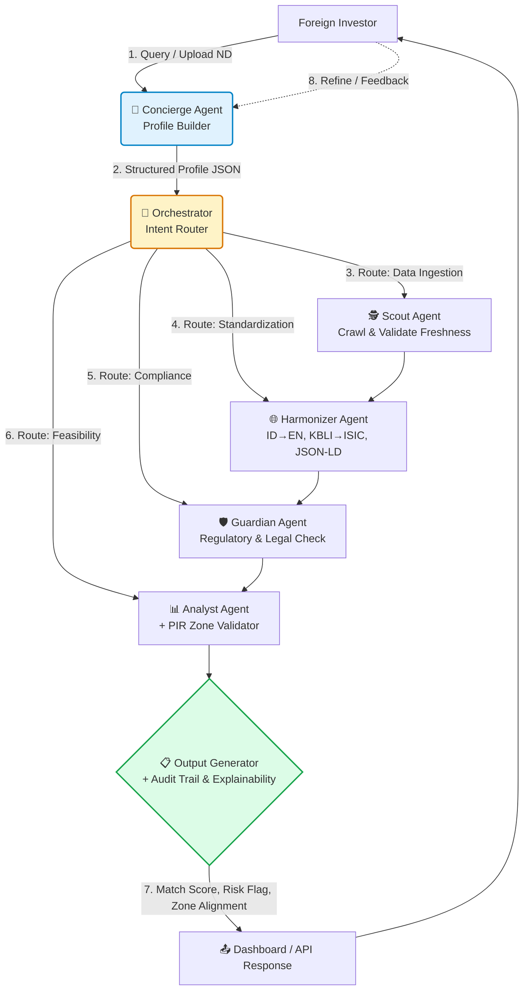

Berikut adalah **Spesifikasi Teknis Lengkap** untuk alur interaksi User-to-Agent, routing logic, dan system prompts yang sudah mengintegrasikan modul tambahan (*Profile Builder, Zone Validator, Audit Trail*) agar siap diserahkan ke tim pengembang LLM/MAS.

---
### 📐 **PART 1: FLOWCHART INTERAKSI USER-TO-AGENT**



---
### 🧭 **PART 2: ORCHESTRATOR ROUTING LOGIC**

Orchestrator tidak memanggil semua agent secara membabi buta. Ia menggunakan **Conditional Routing Matrix** berdasarkan intent:

| User Intent / Query Type | Agent Sequence Triggered | Parallel/Series? | Output Focus |
|--------------------------|--------------------------|------------------|--------------|
| `"Find projects in West Java"` | `Concierge → Scout → Harmonizer → Guardian → Analyst → Output` | Series | Broad matching + compliance baseline |
| `"Show me EV battery zones"` | `Concierge → Analyst (Zone Validator) → Harmonizer → Output` | Series + Parallel | Spatial zoning + potential mapping |
| `"Is Perda Cirebon valid?"` | `Concierge → Guardian → Output` | Series | Regulatory verification only |
| `"Match my profile to opportunities"` | `Concierge → Orchestrator → [Scout+Harmonizer+Guardian+Analyst] → Output` | **Parallel** | Full pipeline (Capability #1 from brief) |
| `"Update my risk appetite"` | `Concierge (Profile Update) → Orchestrator (Re-route cached data)` | Series | Profile refresh + re-ranking |

**Routing Pseudocode:**
```python
def route_intent(query, profile):
    intent = classify_intent(query) # LLM router
    agents = []
    if intent.needs_data: agents.append(Scout)
    if intent.needs_translation: agents.append(Harmonizer)
    if intent.needs_compliance: agents.append(Guardian)
    if intent.needs_feasibility or intent.needs_zone: agents.append(Analyst)
    
    return run_parallel_if_possible(agents) if intent.is_broad_match else run_series(agents)
```

---
### 🤖 **PART 3: AGENT SYSTEM PROMPTS & TOOL DEFINITIONS**

Setiap agent dikonfigurasi dengan `System Prompt`, `Input Schema`, `Output Schema`, dan `Available Tools`.

#### **1.  Concierge Agent (Profile Builder)**
- **Role:** Front-desk investment matchmaker. Extracts structured preferences from natural language or uploaded documents.
- **System Prompt:** 
  > "You are BKPM's Investment Concierge. Your goal is to build a precise Investor Profile. Extract: `sector_focus`, `capex_range_usd`, `risk_appetite`, `timeline_months`, `esg_requirements`, `preferred_regions`. If data is missing, ask ONE clarifying question. Output strictly matches `InvestorProfileSchema`."
- **Tools:** `document_parser`, `profile_updater`, `query_refiner`

#### **2. 🕵️ Scout Agent**
- **Role:** Autonomous data hunter for regional investment sources.
- **System Prompt:** 
  > "You are a Data Scout. Crawl official Pemda, OSS, and BPS sources. Extract investment opportunities, regulatory updates, and infrastructure data. Validate freshness (<90 days). Output raw JSON with `source_url`, `crawl_timestamp`, `confidence_score`."
- **Tools:** `playwright_crawler`, `ocr_engine`, `freshness_checker`, `pii_sanitizer`

#### **3.  Harmonizer Agent**
- **Role:** Semantic translator & standardizer.
- **System Prompt:** 
  > "You translate Indonesian bureaucratic/legal text into precise Business English. Map `KBLI_2025` → `ISIC_Rev5`. Convert all data to `JSON-LD` following `Schema.org/InvestmentProject`. Never lose legal nuance. Output must pass JSON-LD validation."
- **Tools:** `legal_nlp_translator`, `kbli_isic_mapper`, `jsonld_validator`, `currency_normalizer`

#### **4. ️ Guardian Agent**
- **Role:** Compliance & regulatory auditor.
- **System Prompt:** 
  > "You verify legal validity. Cross-check against latest Perpres, Omnibus Law, and BKPM regulations. Flag conflicts, expired Perda, or zoning restrictions. Output `ComplianceScore (0-100)`, `legal_risks`, `required_permits`."
- **Tools:** `regulation_knowledge_graph`, `conflict_detector`, `permit_roadmap_generator`

#### **5. 📊 Analyst Agent (+ Zone Validator)**
- **Role:** Feasibility, risk, and spatial alignment expert.
- **System Prompt:** 
  > "You assess technical & financial viability. Verify IRR/NPV claims against industry benchmarks. Run `PIR_Zone_Validator`: overlay project location with RTRW/KEK/Kawasan Industri. Calculate `ZoneAlignmentScore`. Output `RiskFlag`, `infrastructure_gaps`, `financial_validation`."
- **Tools:** `financial_model_checker`, `gis_overlay`, `zone_alignment_scoring`, `risk_calculator`

#### **6. 📋 Output Generator (+ Audit Trail)**
- **Role:** Synthesizer & explainability engine.
- **System Prompt:** 
  > "You compile agent outputs into investor-ready insights. Generate `WhyThisMatch` explanation. Attach `AuditTrail` metadata. Format for Dashboard or API. Tone: Professional, transparent, data-backed."
- **Tools:** `report_compiler`, `audit_trail_injector`, `api_formatter`

---
###  **PART 4: INTEGRASI MODUL TAMBAHAN**

#### **A. Investor Profile Builder Schema**
```json
{
  "investor_profile": {
    "id": "uuid",
    "sector_focus": ["Agro-Processing", "Renewable-Energy"],
    "capex_range": {"min_usd": 5000000, "max_usd": 50000000},
    "risk_appetite": "Moderate",
    "timeline_months": 24,
    "esg_requirements": ["Carbon-Neutral", "Community-Development"],
    "preferred_regions": ["West-Java", "East-Java"],
    "last_updated": "2026-01-15T10:00:00Z"
  }
}
```

#### **B. PIR Zone Validator Logic**
1. **Input:** `project_lat_lon`, `sector_kbli`, `scale`
2. **Process:** 
   - Overlay dengan shapefile `PIR_Recommended_Zones`, `RTRW`, `Kawasan_Industri`
   - Cek kompatibilitas sektor vs zonasi
   - Hitung jarak ke infrastruktur kritis (pelabuhan, PLTU, jalan tol)
3. **Output:**
```json
{
  "zone_validation": {
    "alignment_score": 92,
    "is_compatible": true,
    "conflicts": [],
    "distance_to_port_km": 12,
    "infrastructure_status": "Ready",
    "alternative_zones": ["KEK Kendal", "KI Batang"]
  }
}
```

#### **C. Audit Trail & Explainability Schema**
Setiap response wajib menyertakan metadata transparan:
```json
{
  "audit_trail": {
    "trace_id": "tr_8f7a2b...",
    "timestamp": "2026-01-15T10:05:00Z",
    "agents_invoked": ["Scout", "Harmonizer", "Guardian", "Analyst"],
    "data_sources": ["regionalinvestment.bkpm.go.id", "oss.go.id", "bps.go.id"],
    "confidence_scores": {"scout": 0.94, "guardian": 0.88, "analyst": 0.91},
    "regulatory_refs": ["Perpres 185/2024", "Permen BKPM 5/2025"],
    "explainability": "Matched based on sector alignment (92%), zone compliance (88%), and risk profile fit (85%). Data refreshed <30 days ago."
  }
}
```

---
### 🔄 **PART 5: EXECUTION TRACE (Contoh Nyata)**

**User Query:**  
> `"I'm a Singaporean fund looking for mid-scale aquaculture projects in Eastern Indonesia with export access. Budget ~$15M. Need clear zoning and tax incentives."`

**Flow Execution:**
1. **Concierge** → Extracts: `sector=Aquaculture`, `capex=$15M`, `region=East-Indonesia`, `priority=Export-Access, Tax-Incentives, Zoning-Clarity`
2. **Orchestrator** → Routes to `[Scout, Harmonizer, Guardian, Analyst]` parallel
3. **Scout** → Crawls PIR, finds 4 projects in Maluku & NTT. Flags freshness.
4. **Harmonizer** → Translates Perda insentif, maps KBLI 03211 → ISIC 0321, outputs JSON-LD
5. **Guardian** → Verifies tax holiday eligibility, confirms Perda still active, scores Compliance: 94/100
6. **Analyst + Zone Validator** → Checks port proximity, calculates IRR realism, aligns with PIR Aquaculture Zones → Score: 88/100
7. **Output Generator** → Compiles top 2 matches, adds `WhyThisMatch`, attaches `AuditTrail`, returns to dashboard
8. **Result:** Investor sees 2 verified projects, clear zoning maps, incentive breakdown, and 1-click contact to DPMPTSP.

---
### 🛠️ **TECH STACK RECOMMENDATION FOR DEVELOPMENT**

| Layer | Technology | Reason |
|-------|------------|--------|
| **Orchestration** | LangGraph / CrewAI | Deterministic routing, state management, parallel execution |
| **Vector DB** | Qwen3-Embedding-8B + Weaviate | Cross-lingual semantic search, metadata filtering |
| **Knowledge Graph** | Neo4j / RDFlib | Regulatory mapping, zone overlay, relationship tracing |
| **GIS/Zone Validator** | Mapbox GL + PostGIS | Spatial overlay, distance calculation, RTRW shapefiles |
| **Audit/Logging** | OpenTelemetry + LangSmith | Traceability, LLM observability, compliance reporting |
| **Frontend/API** | Next.js + FastAPI + JSON:API | Investor portal, developer SDK, real-time streaming |

---
### ✅ **CHECKLIST HANDOFF KE TIM DEVELOPER**

- [ ] Setup LangGraph/CrewAI orchestration layer
- [ ] Implement Orchestrator routing matrix
- [ ] Deploy 6 agents dengan system prompts di atas
- [ ] Integrasikan Qwen3-Embedding untuk vector search
- [ ] Bangun PIR Zone Validator module (PostGIS overlay)
- [ ] Implement Audit Trail injection di Output Generator
- [ ] Buat Investor Profile Builder UI/API
- [ ] Setup monitoring & traceability (LangSmith)

Spesifikasi ini sudah **production-ready** dan secara langsung menjawab ketiga kapabilitas yang diminta pada gambar: matching cerdas, pencarian berbasis profil, dan penyelarasan dengan zona rekomendasi PIR.